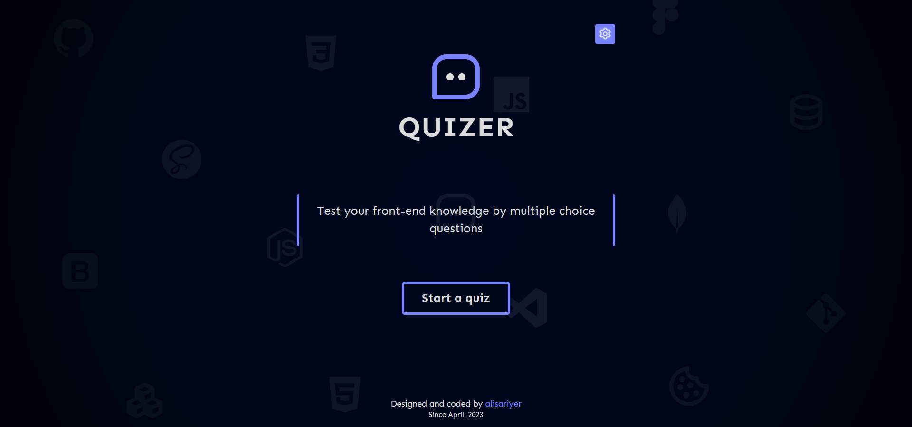

# Quizer
A quiz web application 

## Screenshot

## About
A simple multiply choice quiz application providing user quiz scores, and customization for admin user.

## NOTE
**THIS PROJECT IS STILL IN DEVELOPMENT**. DO NOT USE AS A FULLY WORKING APPLICATION. HOWEVER ACTUAL VERSION CAN BE RUN LOCALLY.

## How to install locally
1. You need to install node.js, mongodb, and git on your computer.
2. Open a terminal.
3. Go into folder where you want to setup project.
4. Run this command to copy repository locally: `git clone https://github.com/alisariyer/quizer.git`
5. Go into project folder by running this command: `cd quizer`
6. As we need to run database and server, it's recommended to open project in VSCode. To do this, run in terminal: `code .`
7. Open terminal in VSCode by using shortcut: **CTLR+`**
8. Then install all dependencies: `npm install`
9. Run your mongo database: `mongod` (for windows)
10. Open a second terminal in VSCode terminal panel.
11. Check current folder that is the project folder.
12. Copy .env.example file and rename as **.env**. Then in .env file modify environment variables. (You can just for now change DB_NAME).
13. Seed the database by the sample data(questions): `npm run seed`
14. Run server app: `npm start`
15. Voilà. Go to http://localhost:3000 page to see project.
16. Now you sign up and test yourself.

## Used Technologies (Top 5)
- Node.js
- **Express.js**
- **SASS**
- **MongoDB**
- Ejs

## Specifications:
- A random quiz (actually only front-end questions)
- User registration/login
- Score table
- Add/Edit/Delete questions
- RestFul

## Credits:
- ...
