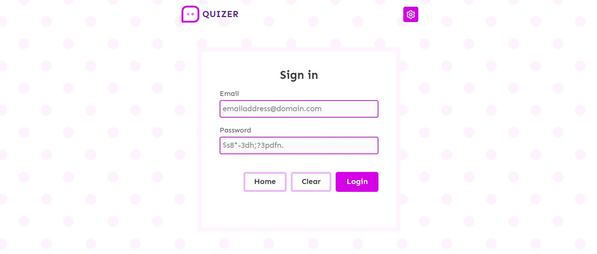
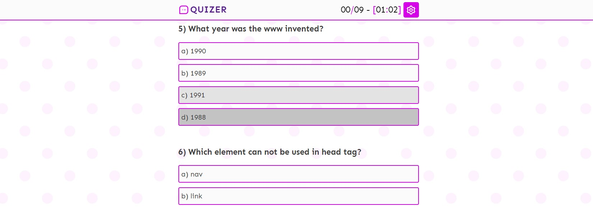
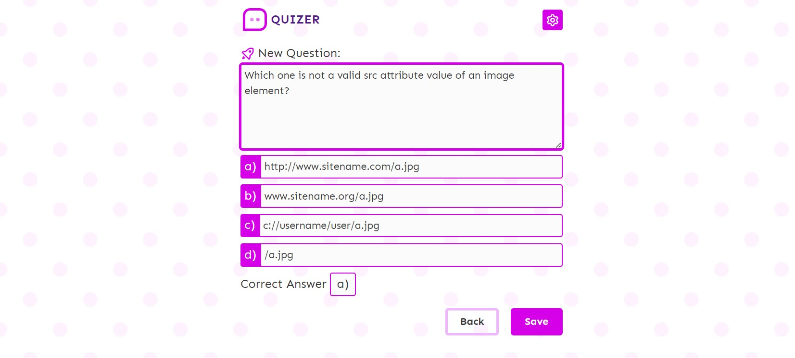

# Quizer
A quiz web application

## Project Details:
- Start date: 25 April 2023

## Project Screenshots

*** 

***

## Used Technologies (Or will be used)
- Node.js
- **Express.js**
- **SASS**
- **MongoDB**
- Ejs
- VSCode
- Git Version Control
- Figma
- Adobe Illustrator

## Specifications:
- A randomize front-end quiz for guest.
- User must be enregistered.
- Admin can add more questions and edit them.
- Score table shows current scores
- Data will be stored in a MongoDB

## Project Structure:
- Homepage
  - Quiz
- Login
- Registration
- Admin
  - New
  - Edit
- About

## REST Structure
- GET /                           : welcome page
- GET /quiz                       : new quiz
- POST /quiz                      : post quiz answers
- GET /questions/new              : add a new question
- GET /questions/:id              : get a specific question
- PUT /questions/:id              : update a specific question
- DELETE /questions/:id           : delete a specific question
